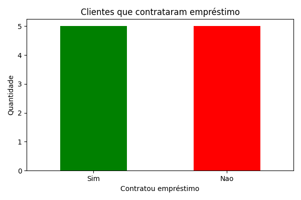
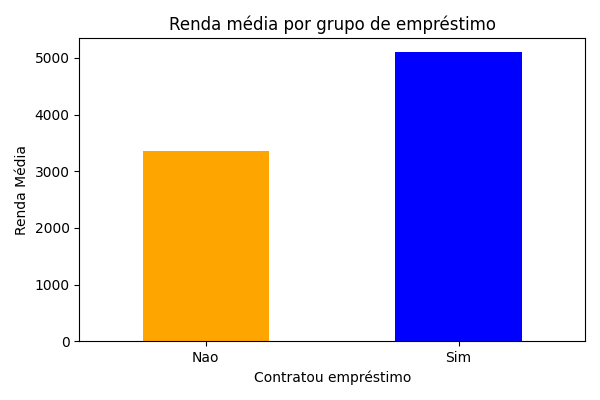

# 📊 Análise de Empréstimos - Docker

Este projeto analisa dados de clientes de um banco de varejo e identifica padrões entre aqueles que contratam empréstimos.

## 🚀 Tecnologias

- Python
- Pandas
- Matplotlib
- Docker

## 📈 Resultados

Dois gráficos são gerados:
1. Quantidade de clientes que contrataram empréstimo.
2. Renda média dos clientes que contrataram ou não empréstimos.

## 📦 Como executar com Docker

1. **Build da imagem:**

docker build -t analise-emprestimos

2. **Rodar o container:**

docker run -v $(pwd):/app analise-emprestimos

Após a execução, os gráficos `grafico_emprestimo.png` e `grafico_renda.png` estarão na pasta do projeto.

## 🖼️ Gráficos Gerados

### 📊 Quantidade de Clientes com Empréstimos

### 💰 Renda Média por Status de Empréstimo

